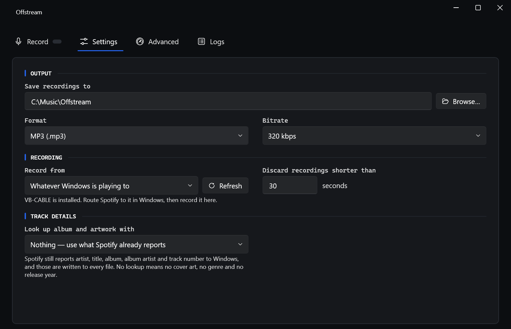
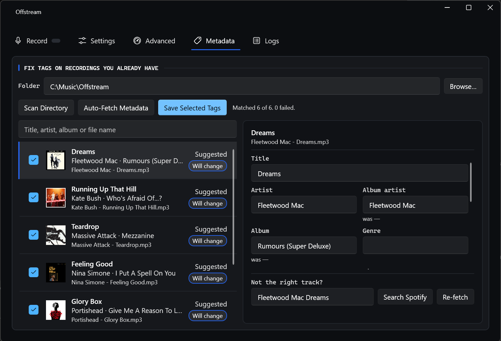
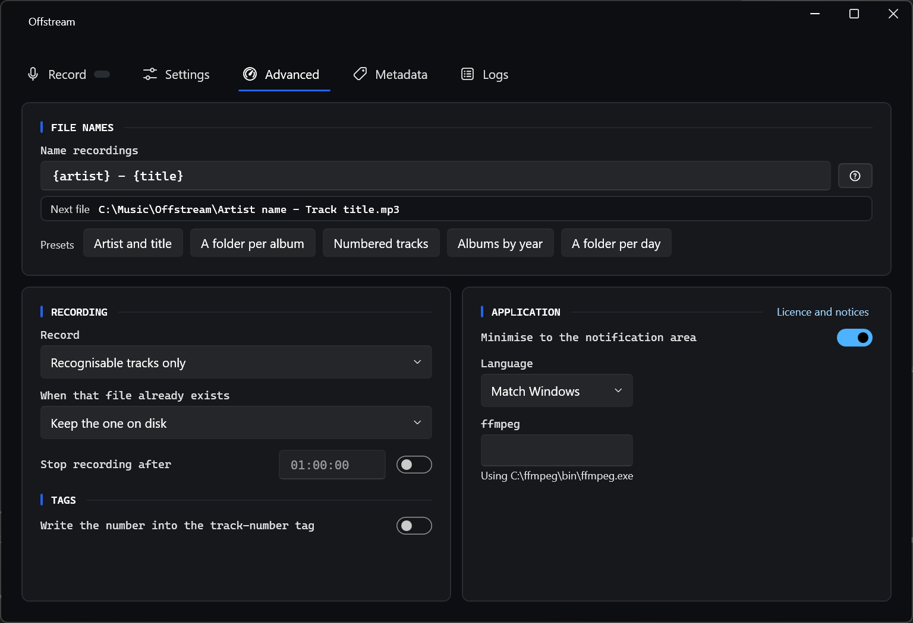

# Offstream

**Offstream records what Spotify plays, one file per song.**

Press Start, put Spotify on, and walk away. Offstream listens to your PC's audio, notices when one
track ends and the next begins, and saves each one as its own MP3 (or WAV, FLAC, AAC, Ogg or Opus)
with the artist, title and album already filled in — and the cover art embedded, if you turn on a
lookup. Nothing to click between songs, no one long file to cut up afterwards.

It is a Windows 11 desktop app. It never asks for your Spotify password, and your recordings stay on
your machine — the only thing that ever leaves it is a "who sings this?" lookup, and only if you
turn one on.


*Twelve seconds into a song. The meter moves with the audio, the cover art and album have already
been looked up, and the Save path shows exactly which file this will become. Each finished track
drops into the list below as it is completed, with its length and a button that opens the folder
it landed in.*

## What it does

- **Splits automatically.** Each song becomes its own file, named the way you choose.
- **Tags as it goes.** Artist, title and album are written into every file; add a lookup and the
  cover art goes in too, so your music player shows the sleeve instead of a grey box.
- **Skips the junk.** Adverts are muted and not recorded, and anything shorter than 30 seconds is
  thrown away, so half-songs and jingles don't pile up.
- **Six formats.** MP3, WAV, FLAC, AAC, Ogg and Opus, at the bitrate you pick.
- **Shows you what's happening.** A live level meter (so silence is obvious while it's happening,
  not an hour later), a list of everything saved this session, and a Logs page with the running
  commentary if you want the detail.
- **Stays out of the way.** Minimises to the notification area and can stop itself after a set time.

## Before you start

Three things worth knowing up front, so nothing is a surprise:

**Download it from [Releases](https://github.com/revtex/offstream/releases).** The installer is
per-user and never asks for administrator rights; the zip is the same build if you would rather not
install anything. **Neither is code-signed**, so Windows SmartScreen warns the first time you run
it — choose **More info**, then **Run anyway**, after checking the download against the SHA-256 in
the release notes. Building from source is the other option, and every step is below.

**It records your PC's sound, not Spotify specifically.** By default Offstream captures whatever
your speakers are playing, so a Windows notification chime or a YouTube tab in the background lands
in the recording too. Either keep the machine quiet while it records, or install the free
[VB-CABLE](https://vb-audio.com/Cable/) virtual audio device, point Spotify at it in Windows' sound
settings, and record that instead — then only Spotify is captured. Offstream tells you on the
Settings page whether VB-CABLE is installed.

**You need ffmpeg only if you build from source.** It's the free tool Offstream uses to turn the
captured audio into MP3s, and releases bundle their own copy in an `ffmpeg` folder beside the
executable. One command installs it otherwise; see
[Getting Offstream running](#getting-offstream-running). If you have one installed anyway, or point
Offstream at a particular build on the Settings page, yours wins over the bundled one.

## Getting Offstream running

Everything here runs in **Windows Terminal or PowerShell on Windows** — not in WSL.

**1. Install the prerequisites**

```powershell
winget install --id Microsoft.DotNet.SDK.10 --source winget
winget install --id Git.Git --source winget
winget install --id BtbN.FFmpeg.LGPL.8.1 --source winget
```

**Close and reopen the terminal afterwards** — installers change `PATH`, and an open window won't
see it. This is the single most common reason `dotnet` seems "not installed" right after installing
it.

**2. Get the code and run it**

```powershell
git clone https://github.com/revtex/offstream.git
cd offstream
.\build.ps1 -Run
```

The first build takes a few minutes; after that it starts in seconds.

**3. Set your folder and format**

Open **Settings**. Choose where recordings go, pick a format and bitrate, and choose which audio
device to listen to.



Defaults are sensible if you'd rather not decide: recordings go to `%USERPROFILE%\Music\Offstream`
(your own Music folder — the `C:\Music\Offstream` above is just an example), the format is 320 kbps
MP3, the device is whatever Windows is currently playing through, and anything under 30 seconds is
discarded.

**4. Press Start, then play something**

Go back to **Record** and press Start. Play music in Spotify. Offstream waits for a track to begin,
records it to the end, saves it, and immediately starts on the next one. The list fills up as it
goes, and **Show in Explorer** beside a row opens the folder it landed in.

Press Stop when you're done. The part-recorded song is finished off and encoded before the session
closes, rather than being dropped on the floor — unless it's shorter than your minimum length, in
which case it's discarded like any other fragment.

The display above the meter watches the capture while you are not. It carries what the file will be —
format, bitrate, sample rate, the device being recorded and the size so far — and lights a **`SILENT`**
lamp if nothing has been heard for a few seconds, or **`CLIP`** if the audio hit full scale. With a timer
set on the Advanced page, a **`STOPS IN`** countdown appears beside the elapsed clock.

## Better tags and cover art

With no provider configured, Offstream writes what Spotify itself reports to Windows: artist, title,
album, album artist and track number. That's enough for tidy filenames and a tidy library, but
there's no cover art in it, no genre and no release year.

To fill those in, pick a provider on the Settings page:

| Provider | What it adds | What it needs |
| --- | --- | --- |
| **Nothing** | — (what Spotify reports, and no more) | — |
| **Last.fm** | Cover art and genre | A free API key — takes a minute at [last.fm/api](https://www.last.fm/api/account/create) |
| **Spotify** | Cover art, genre, release year, disc number and copyright | Your own free app on the [Spotify Developer Dashboard](https://developer.spotify.com/dashboard), then one sign-in |

Offstream starts with **Last.fm** selected, so on first run it asks for a key. Paste one in, or
switch the box to **Nothing** if you'd rather not bother — recording works either way.

Spotify is the only provider that can fill in the release year. To use it, create an app on the
dashboard, register `http://127.0.0.1:4002/callback` as its redirect URI, paste the Client ID into
Settings and press **Sign in**. Your browser opens once; after that Offstream keeps itself signed
in.

> **The keys are yours, not ours.** Offstream ships no API keys of its own and asks you for your
> own instead. A shared key gets rate-limited across everybody using it and can be switched off by
> someone who isn't you. Your Spotify sign-in is stored encrypted for your Windows account only, and
> Offstream asks for the narrowest permission that works: reading what's currently playing. It never
> sees your password.

## Fixing tags on recordings you already have

Offstream tags a recording while it makes it, so a track recorded before you set up a provider —
or while Last.fm was down, or whose title Spotify reported oddly — keeps whatever thin tags it got
at the time. The **Metadata** tab is where you repair those.



1. **Scan Directory** reads every taggable file in the folder shown. It starts at your recordings
   folder; **Browse…** points it somewhere else, so a library Offstream didn't record works too.
2. **Auto-Fetch Metadata** looks up the files that are missing a title, artist or album. Spotify is
   asked first if you're signed in, then Last.fm if you have a key. Files that already have all
   three are left alone and cost no lookup — use **Re-fetch** in the editor when a track's tags
   are complete but wrong.
3. **Save Selected Tags** writes the ticked rows into the files. Nothing reaches a file before that.

Clicking a row fills the editor on the right: title, artist, album artist, album, genre, year, disc,
track, tracks on album and copyright — every tag Offstream writes while recording, so anything it
can put into a file it can also repair. A **was …** line sits under anything you'd be changing, and
artwork a lookup found is shown below the boxes, before and after.

- **Will change** marks the rows that would actually alter a file, which is how you find the three
  that need attention without reading the other hundred.
- **Filter** narrows the list by title, artist, album or file name. It only changes what is on
  screen: Save still writes every ticked row, including the ones the filter is hiding.

### When the match is wrong

Untick the row and nothing happens to that file. To fix it instead, type over the boxes — your
edits win over anything a lookup found — or use **Not the right track?** at the foot of the pane,
which searches Spotify for whatever you type and lists what it finds, with the year beside each
result so you can tell a remaster from the original. **Use this** fills the row in from the one you
pick, cover art included.

Reach for that search rather than **Re-fetch** whenever the artist is the thing that's wrong.
Re-fetch builds its query from the file's own fields and refuses any result that disagrees with
them, so it cannot reach a track those fields point away from.

A few things worth knowing:

- **Clearing a box stops Offstream changing that tag; it doesn't erase it.** Save writes no blank
  over a value, and a lookup that found no genre leaves the file's own alone.
- **Commas separate genres, not names.** "Earth, Wind & Fire" in an artist box stays one band.
- **`.wav` files are skipped**, and the page says how many. WAV has no tag format players agree on,
  so a row for one would look editable and then fail when you saved it.
- **A file that's open elsewhere can't be written.** If you're playing the track you're retagging,
  the row says so; close it and press Save again.
- **MP3 tags stay ID3v2.3**, the version Windows Explorer and Media Player actually read.

## Naming files, and the rest of the options

The **Advanced** page is where the details live.



**File names** are a template with a live preview, so you can see exactly what the next file will be
called before you record anything. Use `\` to make folders — `{artist}\({year}) {album}\{track:00}
{title}` gives you a tidy library tree instead of one flat pile, and is the template producing the
Save path in the first screenshot. The `:00` pads a number to two digits, so track 2 files as `02`
and sorts where you expect it to.

| Token | Is replaced with |
| --- | --- |
| `{artist}` `{title}` `{album}` `{album_artist}` `{track}` | What Spotify reports |
| `{year}` `{disc}` | Release year and disc number — needs the Spotify provider |
| `{count}` | A counter that keeps climbing across sessions, so files sort in the order you made them |
| `{date}` `{time}` | When it was recorded |

The rest of the page, briefly:

- **Name recordings** — the filename template, with a live preview of the next file. Five presets
  sit under it — artist and title, a folder per album, numbered tracks, albums by year, a folder
  per day — and each one's tooltip shows the names it would produce before you pick it.
- **Record** — how much of what Spotify plays is worth keeping. *Recognisable tracks only* is the
  default: Offstream saves what Spotify reports as an artist and a title and discards the rest.
  Widen it to *everything except advertisements* to keep podcasts too, or to *everything,
  advertisements included* if you want the lot.
- **When that file already exists** — keep the one on disk, keep it and have Spotify skip to the
  next track, replace it, or save the new one alongside it.
- **Stop recording after** — a timer, for recording overnight or for exactly an hour.
- **Number the tracks** — writes the counter into the track-number tag, so players sort recordings
  in the order they were made.
- **Minimise to the notification area** and **language** (English or French).
- **ffmpeg location** — leave it empty and Offstream finds ffmpeg on your `PATH` by itself. Fill it
  in only if you keep ffmpeg somewhere unusual. (The `C:\ffmpeg\bin\ffmpeg.exe` above is an example,
  not a requirement.)

## Recording a bit-exact copy

Offstream writes down whatever the audio device hands it, so a recording is only as faithful as
the path in front of it. Four things on that path change the audio by default, and all four are
settings rather than limitations.

| What changes it | Where | Set it to |
| --- | --- | --- |
| **Sample-rate conversion** | `mmsys.cpl` → Playback → **CABLE Input** → Properties → Advanced, *and* Recording → **CABLE Output** → Properties → Advanced | **44100 Hz on both.** They have to match each other, or Windows converts between them. Spotify's lossless tier streams at 44.1 kHz; a cable set to 48 kHz makes Windows resample every track on the way through. |
| **Bit depth** | The same two Advanced tabs | **24-bit.** Windows mixes in 32-bit float, and a 24-bit sample is the largest that survives that exactly — 32-bit integer does not, and 16-bit throws away depth the stream may be carrying. |
| **Loudness normalisation** | Spotify → Settings → Playback → **Normalize volume** | **Off.** It is on by default and applies gain before the audio ever leaves Spotify, so with it on the recording is a scaled copy however well the rest is set up. |
| **Volume, in four places** | Spotify's own slider; Windows Volume Mixer → Spotify; CABLE Input → Levels; CABLE Output → Levels | **100 % everywhere.** Any gain that is not exactly 1.0 is applied in floating point and rounded back on the way out. |

Then two choices in Spotify and Offstream themselves:

- **Spotify → Settings → Media Quality → Streaming quality: Lossless.** It is set per device, so set
  it on the desktop app you are recording, not on your phone. Spotify falls back on a slow
  connection and says so while it is playing — worth a glance before a long session.
- **Offstream: Format FLAC.** MP3, AAC and Opus re-encode by definition and can never be exact.
  WAV cannot either, here: Offstream writes 16-bit WAV, so it loses depth that FLAC keeps.

### Checking it worked

```powershell
# 1. Sample rate and depth. Want 44100 / s32 / 24.
ffprobe -v error -select_streams a -show_entries stream=sample_rate,sample_fmt,bits_per_raw_sample `
  -of default=noprint_wrappers=1 "01 Your Track.flac"

# 2. Draw the spectrum, then open spectrum.png and look at the top of it.
ffmpeg -v error -y -i "01 Your Track.flac" -lavfi "showspectrumpic=s=900x420:legend=1" spectrum.png

# 3. Peak level, to catch anything still turning the volume down.
ffmpeg -v info -nostats -i "01 Your Track.flac" -af volumedetect -f null NUL
```

The picture is the one that catches the mistake you cannot hear. Audio stops dead at some
frequency, and where it stops tells you what the file really came from:

| The spectrum runs to | And the file says | Meaning |
| --- | --- | --- |
| The top of the frame | `44100` | Right. Nothing resampled it. |
| ~22 kHz, with a dead band above it | `48000` | Windows resampled a 44.1 kHz stream. The file is a real 48 kHz file whose top 2 kHz is empty — match the cable to 44100 and record it again. |
| ~20 kHz | either | Not lossless. Check Spotify's streaming quality, and that it has not fallen back. |

## Where things are kept

| What | Where |
| --- | --- |
| Recordings | Wherever you chose — by default `%USERPROFILE%\Music\Offstream` |
| Settings | `%APPDATA%\Offstream\settings.json` |
| Logs | `%APPDATA%\Offstream\logs\` |

Setting the `OFFSTREAM_HOME` environment variable moves settings and logs somewhere else, which is
handy for testing against a clean profile without disturbing your real one.

## If something goes wrong

| What you see | What's happening |
| --- | --- |
| **"Offstream can't find ffmpeg"** | ffmpeg isn't installed or isn't on `PATH`. Run the winget command above, then **reopen the terminal** and restart Offstream. |
| **A `SILENT` lamp on the display, and the meter is flat** | Offstream is listening to a different audio device than the one playing — the commonest way to record an hour of nothing. Check **Record from** on the Settings page. |
| **A `CLIP` lamp on the display** | The audio reached full scale, so this track may be distorted. Turn Spotify's own volume down a little and record it again; the lamp clears when the next track starts. |
| **Recordings are 48 kHz, but Spotify streams lossless at 44.1** | The virtual cable is set to 48 kHz, so Windows resamples every track on the way through. See [Recording a bit-exact copy](#recording-a-bit-exact-copy). |
| **Recordings include notification sounds, browser audio, everything** | Expected — you're recording the whole output device. Use VB-CABLE as described above to capture Spotify alone. |
| **Files have no cover art** | No metadata provider is selected, or its key is missing. See [Better tags and cover art](#better-tags-and-cover-art). |
| **Short files keep being thrown away** | That's the minimum-length setting doing its job. Lower it on the Settings page if you're recording something genuinely short. |
| **Recording stopped by itself** | Usually the audio device went away — headphones unplugged, or a device switched off. Offstream saves the track in progress, says so in the log, and returns to idle; plug it back in and press Start. |
| **The window won't open, but it's running** | It's in the notification area. Click the tray icon, or turn off "minimise to the notification area". |

The **Logs** page shows recent activity, and the full log files are under
`%APPDATA%\Offstream\logs\` if you need to attach one to a bug report.

## A note on what you record

Offstream is for recordings you keep for yourself. Spotify's Terms of Use don't allow redistributing
what you capture, and copyright law where you live applies to it as much as to anything else. What
you record, and what you do with it, is on you.

---

# For developers

Offstream is **.NET 10 + WPF**, MVVM throughout, with `Offstream.Core` holding the whole pipeline
and no reference to WPF. **Every audio conversion goes through ffmpeg** — there are no bundled
encoders. It succeeds **Spytify**, a .NET Framework 4.6.1 / WinForms app, and inherits its
behaviour but none of its names.

**Offstream targets Windows 11 only.** Windows 10 left support in October 2025 and is out of scope.

Read, in order: **[`docs/MODERNIZATION-PLAN.md`](docs/MODERNIZATION-PLAN.md)** for architecture, the
parity matrix and the ten phases; then
**[DR-0001](docs/decisions/0001-phase-0-retarget-spike.md)**, which invalidates one of the plan's
original assumptions and records what replaced it; then
**[DR-0002](docs/decisions/0002-phase-1-solution-scaffold.md)**.

<details>
<summary><b>Status — phases 0–7 complete, phase 8 (packaging) next</b></summary>

```powershell
.\build.ps1 -Clean -Test                 # 1,128 green; add -IncludeDesktop for the FlaUI suite
dotnet run --project src/Offstream.App
```

- **Phase 0** — the retarget proof: 8/8 checks green on Windows 11 build 26200, unelevated. Endpoint
  enumeration, `IAudioPolicyConfig` binding, routing a process to an endpoint and back, session mute,
  and 30 s of WASAPI loopback capture verified non-silent.
- **Phase 1** — six projects, CI, analyzers as errors, Serilog, and a WPF-UI Fluent shell that
  launches and is driven by a FlaUI test.
- **Phases 2–3** — the reference suite green on .NET 10, then the recording pipeline: capture, track
  detection, and ffmpeg encoding to MP3/WAV/FLAC/AAC/Ogg/Opus with tags and cover art.
- **Phase 4** — Spotify Web API metadata over PKCE, with the refresh token protected by DPAPI.
  Browser sign-in and the Last.fm provider beside it landed later, once there was a Settings page to
  configure them from.
- **Phase 5** — settings at `%APPDATA%\Offstream\settings.json`: grouped schema, atomic writes, no
  importer for the predecessor's file.
- **Phase 6** — the shell: Record, Settings, Advanced and Logs pages, inline validation, en/fr
  resources, a live waveform, tray icon and single-instance guard.
- **Phase 7** — Windows integration: SMTC track detection, extended-length paths, audio endpoint
  hot-plug, VB-CABLE detection.

**Phase 8 is packaging and release**, and plan open question 9 — the VB-CABLE licence — blocks part
of it.

</details>

<details>
<summary><b>Offstream owns its own names</b></summary>

Behaviour is inherited. **Naming is not.** Every namespace, type, file, folder, project, resource key
and on-disk path in this repository is Offstream's own — nothing carries `EspionSpotify`, `Spytify`,
or any other predecessor identifier, and a build-time test fails the build on one. A file copied over
from the old tree gets renamed and re-namespaced in the same commit that introduces it.

Offstream ships **no importer** for the old app's `user.config`: first run starts from clean
defaults. Plan [§0](docs/MODERNIZATION-PLAN.md) is the full rule and mapping table.

</details>

<details>
<summary><b>Relationship to the app being retired</b></summary>

The predecessor lives at `../spy-spotify` (a fork of the unmaintained
[`jwallet/spy-spotify`](https://github.com/jwallet/spy-spotify)). It stays on disk as a **reference
to read**, not a dependency. Nothing here builds against it, and nothing here is named after it.

It matters for three reasons:

1. **Source of truth for behaviour.** Spotify window-title parsing, ad and idle-state detection, the
   audio ring buffer and silence-trim semantics, and the filename template engine all encode years of
   edge cases. Port the logic; don't reinvent it — and rename it on the way in.
2. **Its test suite is the safety net.** 293 xUnit tests come across with their assertions intact
   under `Offstream.Core.Tests`. Phase 2's exit criterion was all of them green on .NET 10 *before*
   any behaviour changes.
3. **It owns the hardest asset.** `Router/AudioPolicyConfigFactory*` drives per-application audio
   routing through the undocumented `IAudioPolicyConfig` COM interface. That behaviour transfers into
   `Offstream.Core.Interop.Routing` — though not its marshalling, which .NET 10 required a rewrite of
   (see DR-0001). It is the main reason this is a retarget rather than a rewrite, and the reason a
   Go/Wails rewrite was rejected.

Reference paths **in the old tree** (read-only; none of these names appear in this repo):

| Path | What it holds |
| --- | --- |
| `EspionSpotify/Router/` | Undocumented audio-routing COM interop |
| `EspionSpotify/AudioSessions/` | WASAPI capture, throttler, circular buffer |
| `EspionSpotify/Spotify/` | Process and window-title track detection |
| `EspionSpotify/Models/FileNameTemplate.cs` | Filename template engine |
| `EspionSpotify/Native/FileManager.cs` | Path assembly, length budgeting |
| `EspionSpotify.Tests/` | The 293-test suite |
| `EspionSpotify.FakeSpotify/` | Harness that simulates Spotify window titles |
| `BUILD.md`, `CLAUDE.md` | How the old app builds; its architecture notes |

The old solution is .NET Framework 4.6.1 and **needs a different toolchain** — MSBuild from Visual
Studio Build Tools plus `nuget.exe`, not the `dotnet` CLI. Its own `BUILD.md` covers this, and you
only need it to run the old app side by side for comparison.

</details>

<details>
<summary><b>Development environment</b></summary>

### Prerequisites

| Requirement | Why | winget package |
| --- | --- | --- |
| **Windows 11** | WASAPI, undocumented audio-routing COM | — |
| **.NET 10 SDK** | Build, test, run | `Microsoft.DotNet.SDK.10` |
| Git | — | `Git.Git` |
| **ffmpeg + ffprobe** | Runtime encoding *and* integration tests | `BtbN.FFmpeg.LGPL.8.1` |
| Spotify desktop | Manual testing (`Offstream.FakeSpotify` covers most cases) | `Spotify.Spotify` |
| VB-CABLE *(optional)* | Testing the audio-routing path | not on winget — see below |
| WiX v4 *(Phase 8 only)* | Installer | `dotnet tool install --global wix` |

Everything runs in **Windows PowerShell or Windows Terminal on Windows itself** — not in WSL. This is
a Windows desktop app using Windows-only COM and audio APIs; it cannot be built or run from a Linux
shell, even though the repo may live on a drive both can see. No step needs an elevated prompt except
VB-CABLE.

### The .NET SDK, specifically

The SDK is what matters, not the runtime. A machine can have several .NET runtimes and still be
unable to build anything:

```powershell
dotnet --list-sdks       # must list a 10.x entry — empty output means runtime-only
dotnet --list-runtimes   # informational; runtimes alone are not enough
```

> The runtime-only state is not hypothetical — this repo was created on a machine with the .NET 3.1
> and 8.0 *runtimes* and no SDK at all, so nothing could be built. `.\build.ps1` fails fast with the
> install command when it sees that.

Install the **x64** SDK on an x64 machine and the **Arm64** SDK on Arm64 (Snapdragon X, etc.); winget
picks correctly on its own, but a hand-downloaded installer may not. Check with
`echo $env:PROCESSOR_ARCHITECTURE`.

### ffmpeg

Both `ffmpeg` and `ffprobe` must be on `PATH` — the encode-integration tests shell out to them and
assert results with `ffprobe`.

`BtbN.FFmpeg.LGPL.8.1` is an **LGPL** build, which is the licensing posture Offstream must ship under
(plan §5.1), so developing against it keeps dev and release consistent. `Gyan.FFmpeg` also works
locally but is a GPL build — don't let it become the bundled one.

### VB-CABLE (optional, routing work only)

Not available through winget. Download the VB-CABLE Virtual Audio Device from
[vb-audio.com](https://vb-audio.com/Cable/), unzip, right-click `VBCABLE_Setup_x64.exe` → **Run as
administrator**, then reboot.

> The predecessor **bundles** the whole VB-CABLE package and installs it from its own UI. Offstream
> does not, and no vendor binaries belong in this repo for now — VB-CABLE is donationware whose
> licence forbids integrating it into another installation procedure without the author's agreement.
> That is plan open question 9; until it is answered, Offstream **detects** the cable and links out.

### Setup troubleshooting

| Symptom | Cause and fix |
| --- | --- |
| `dotnet` not recognised after installing | Terminal predates the `PATH` change — open a new one. |
| `dotnet --list-sdks` is empty | Runtime installed, SDK not. Install `Microsoft.DotNet.SDK.10`. |
| `NETSDK1045: current SDK does not support .NET 10` | An older SDK is winning on `PATH`, or a `global.json` pins an older version. Check `dotnet --version`. |
| `ffmpeg` not recognised in tests only | Your IDE inherited the pre-install environment. Restart the IDE, not just the terminal. |
| Build fails under WSL / on Linux | Expected — `net10.0-windows` and the COM interop are Windows-only. Build from Windows. |
| `winget` prompts about source agreements | Run `winget list --accept-source-agreements` once. |

</details>

<details>
<summary><b>Building, running and publishing</b></summary>

### `build.ps1`

The usual tasks are wrapped in a script at the repo root. It checks the environment first — .NET 10
SDK actually present (not just a runtime), ffmpeg on `PATH` before running tests — and fails with the
fix rather than a compiler error.

```powershell
.\build.ps1                          # Debug build
.\build.ps1 -Configuration Release
.\build.ps1 -Test                    # build, then run the whole suite
.\build.ps1 -Test -Filter FileNameTemplate
.\build.ps1 -Clean -Test             # delete every bin\ and obj\, rebuild, then test
.\build.ps1 -Format                  # apply .editorconfig
.\build.ps1 -VerifyFormat            # what CI enforces
.\build.ps1 -Publish                 # self-contained win-x64 publish
.\build.ps1 -Run                     # build and launch
```

If PowerShell blocks the script, either unblock it once (`Unblock-File .\build.ps1`) or run it as
`powershell -ExecutionPolicy Bypass -File .\build.ps1`.

### CLI

The script is a convenience, not a wrapper you're locked into:

```powershell
dotnet restore
dotnet build
dotnet test                                   # whole suite
dotnet test --filter FullyQualifiedName~FileNameTemplate
dotnet test -- --coverage                     # coverage report
dotnet run --project src/Offstream.App
dotnet watch --project src/Offstream.App      # hot reload
dotnet format                                 # apply .editorconfig
dotnet format --verify-no-changes             # what CI enforces
```

Publishing (self-contained, **untrimmed and non-AOT**):

```powershell
dotnet publish src/Offstream.App -c Release -r win-x64 `
  --self-contained true `
  -p:PublishSingleFile=true `
  -p:PublishTrimmed=false
```

> **Do not enable `PublishTrimmed` or `PublishAot`.** The audio-routing code relies on built-in COM
> interop, which AOT does not support, and WPF trims poorly. This is a correctness constraint, not a
> preference — see `CLAUDE.md`.

</details>

<details>
<summary><b>Editors and IDEs</b></summary>

### VS Code (primary workflow)

Open the folder; VS Code will prompt for the recommended extensions in `.vscode/extensions.json`:

- **C# Dev Kit** (`ms-dotnettools.csdevkit`) — solution view, test explorer, debugging
- **C#** (`ms-dotnettools.csharp`) — Roslyn language server
- **XAML Styler** (`ms-dotnettools.xaml`) — XAML formatting and IntelliSense
- **EditorConfig** — honours the repo's `.editorconfig`

`.vscode/tasks.json` and `.vscode/launch.json` are committed, so `Ctrl+Shift+B` builds and `F5`
debugs the WPF app.

**One real limitation to plan around:** *VS Code has no WPF visual designer.* That is Visual Studio
only. In practice this matters less than it sounds — MVVM means the XAML is declarative markup. Two
things make it comfortable:

1. **XAML Hot Reload** works from the CLI — `dotnet watch --project src/Offstream.App` restarts on C#
   changes and applies XAML edits live.
2. Keep Visual Studio installed for the occasional layout-heavy view, and edit everything else in VS
   Code.

Given how much friction the old app's WinForms designer caused — geometry expressed as
`tableLayoutPanel` row/column arithmetic, spread across generated code — hand-written XAML is a net
improvement for this workflow, not a compromise.

### Visual Studio 2022+

1. Install with the **.NET desktop development** workload (WPF templates, the XAML designer, the test
   runner).
2. Ensure the **.NET 10** individual component is checked.
3. Open `Offstream.slnx`, set `Offstream.App` as the startup project, press F5.

Use it when you want the XAML designer, the visual tree / live property explorer, or the profilers.

### Rider

Open `Offstream.slnx`. Configure the .NET 10 SDK under *Settings → Build → Toolset*. Rider has its
own XAML preview and the best refactoring for a port of this size.

</details>

<details>
<summary><b>Testing</b></summary>

The suite is the safety net for the whole port, so it should be fast and offline:

```powershell
dotnet test                                        # all
dotnet test tests/Offstream.Core.Tests             # unit + golden + integration
dotnet test tests/Offstream.UI.Tests               # ViewModels, resources, and the FlaUI suite
dotnet test --filter "Category!=Desktop"           # what CI runs
```

- **Integration tests shell out to real ffmpeg** and assert results with `ffprobe`, so both must be
  on `PATH`.
- **No test may hit the network.** Spotify and Last.fm are covered by recorded fixtures.
- **`Category=Desktop` tests launch the real window** and drive it with FlaUI, so they need an
  interactive session and cannot share a machine with someone using the keyboard. CI and `build.ps1`
  exclude them unless you pass `-IncludeDesktop`. They point the app at a throwaway `OFFSTREAM_HOME`,
  so a run never touches your own settings.
- **A naming-hygiene test fails the build on a forbidden identifier**, and an en/fr key-parity test
  fails on a missing translation.
- CI runs the same commands on `windows-latest` with analyzers as errors, plus
  `dotnet format --verify-no-changes` and a check that the pull request updated `CHANGELOG.md`.

</details>

<details>
<summary><b>Layout</b></summary>

```
src/     Offstream.Core (no UI refs) and Offstream.App (WPF)
tests/   Offstream.Core.Tests (xUnit), Offstream.UI.Tests (ViewModels + FlaUI)
tools/   Offstream.FakeSpotify (window-title harness)
build/   installer, signing, icons
docs/    modernization plan, decision records, screenshots
```

</details>

<details>
<summary><b>Releasing</b></summary>

**The tag is the version.** Nothing in the repo records a released version number, so the two cannot
disagree about what shipped.

Cutting a release is two steps, and the pipeline refuses to skip the first.

**1. Close the changelog, in a pull request.** Rename `## [Unreleased]` to `## [0.1.0] - 2026-08-14`
and open a fresh empty `## [Unreleased]` above it. That section becomes the release notes verbatim.

**2. Tag the merge commit and push the tag.** Everything else is automatic — build, test, publish,
sign, package, GitHub release.

```powershell
git tag v0.1.0
git push origin v0.1.0
```

Pushing a tag with no matching changelog section fails in seconds, before anything is built, and says
what to do. Falling back to `[Unreleased]` instead would work exactly once: every later release would
republish everything above it, including entries that shipped in the previous one, and the only fix
is amending a release people have already read.

A tag that is not `vMAJOR.MINOR.PATCH` — optionally with a prerelease suffix, `v1.2.3-rc.1` — is
rejected before anything is built, since a tag is not meaningfully editable once anyone has fetched
it. A prerelease suffix also marks the GitHub release as a prerelease, so it does not become what
"latest" resolves to.

To exercise the pipeline without spending a version number, run the **Release** workflow manually
from the Actions tab: it builds and uploads the same artefacts and creates no release.

`VersionPrefix` in `Directory.Build.props` only decides what an *unreleased* build calls itself
(`0.1.0-dev`). Nudge it after a release so dev builds sort after it; nothing breaks if you forget.

**The installer is per-user and never asks for administrator rights** — `build/windows/offstream.iss`,
compiled by `build-installer.ps1` from the same staged folder the portable zip is made from, so the
two downloads cannot hold different software under one version number. It installs into
`%LOCALAPPDATA%\Programs\Offstream`, refuses to run on anything below Windows 11, and asks on
uninstall whether to remove settings and logs as well. Recordings are never in its scope. CI compiles
the script on every pull request, because a script that is only compiled at tag time is one that
breaks at tag time.

**ffmpeg is bundled, and pinned.** `build/windows/ffmpeg.json` names the exact LGPL build, its
SHA-256 and the commit it came from; `fetch-ffmpeg.ps1` refuses anything that does not match. The
binaries are not in this repository — 108 MB of someone else's build does not belong in a git
history — so a release fetches them, and `build.ps1 -Publish -BundleFfmpeg` reproduces that locally.
Distributing an LGPL binary obliges distributing its source, so each release attaches the matching
source archive rather than offering to supply it later.

**Builds are not code-signed yet.** `build/windows/sign.ps1` is wired into the pipeline and does
nothing while no certificate is configured — it says so and exits 0. Setting the
`OFFSTREAM_SIGNING_PFX_BASE64` and `OFFSTREAM_SIGNING_PASSWORD` repository secrets is all that is
needed to turn it on. Until then, SmartScreen warns on first run and the release notes say so.

</details>

## Licence

MIT. Portions of the logic derive from the predecessor, which is MIT-licensed; its copyright notice
is retained in `LICENSE` alongside Offstream's. Attribution is a licence obligation and lives there
— it is not a reason to keep the predecessor's identifiers in the source.

[`NOTICE`](NOTICE) records what was ported and lists every third-party component with its licence,
including the one that is not MIT: **TagLibSharp is LGPL-2.1-only**, which constrains how it may be
packaged.

Metadata and cover art from the Spotify Web API are Spotify's, and are attributed on the Settings
page beside the provider that requires it.
